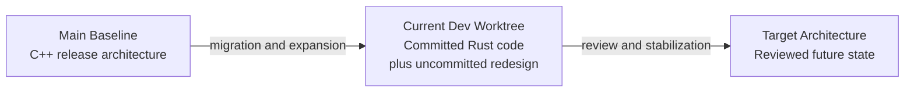
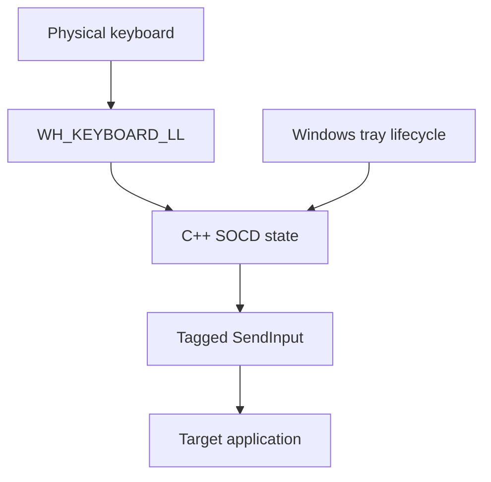
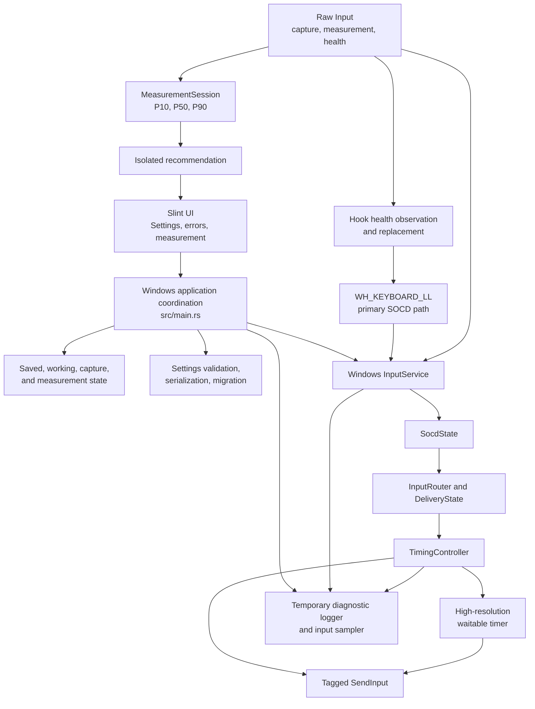
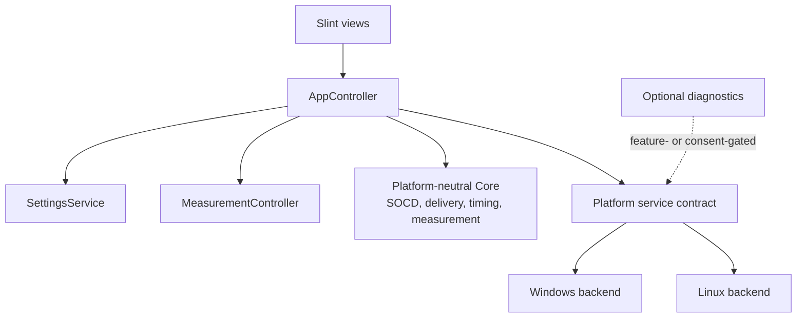

# LastKey Architecture and Roadmap Context

> Audience: idea-generation and architecture-review agents  
> Repository: `Chikorita0964/LastKey`  
> Snapshot date: 2026-09-03  
> Comparison scope: `main` versus the complete current `dev` worktree  
> Purpose: describe the current system, target direction, constraints, progress, and open questions before generating new implementation ideas

## 1. How to Read This Document

This document distinguishes three states. Do not merge them when reasoning about LastKey.

| State | Meaning |
| --- | --- |
| **Main Baseline** | The current `main` branch at `a4f35b6`, representing the established C++ Windows implementation and its behavior. |
| **Current Dev Worktree** | The entire checked-out `dev` workspace: committed Rust work through `44284a4`, all modified tracked files, and all untracked files. In this document, **dev always means this complete worktree**, not only `dev` HEAD. |
| **Target Architecture** | The intended reviewed end state. It is a goal, not a claim about current code. |

The committed/uncommitted boundary is recorded only as implementation maturity. It does not define a separate architecture.

Use these status labels throughout:

| Status | Meaning |
| --- | --- |
| `BASELINE` | Behavior provided by `main` and used as the compatibility reference. |
| `COMMITTED` | Present in committed `dev` history and still present in the current worktree. |
| `IN PROGRESS` | Present in the current worktree but not yet committed or fully accepted. |
| `EXPERIMENTAL` | Implemented as a prototype but not at release quality. |
| `PLANNED` | Intended but not implemented. |
| `OPEN` | Requires a product or architecture decision. |
| `TEMPORARY` | Diagnostic or transitional work that must not be treated as a product requirement. |
| `BLOCKED` | Cannot safely progress without a preceding decision or environment validation. |



## 2. Executive Summary

LastKey is a local SOCD filter whose primary behavior is Last Input Priority for two opposing key pairs. The Main Baseline is a small Windows C++ tray utility with hard-coded W/S and A/D mappings. It captures input using `WH_KEYBOARD_LL`, resolves SOCD state, and emits tagged synthetic input using `SendInput`.

The Current Dev Worktree is a Rust-first expansion. It contains a platform-neutral SOCD core, output-delivery recovery, runtime key mapping, persistent settings, a Slint settings UI, configurable SOCD overlap handling, input-timing measurement, percentile-based recommendations, a Windows high-resolution scheduler, and an experimental Linux `evdev`/`uinput` backend.

The Current Dev Worktree is not release-ready. The Windows input path and timing scheduler are substantially implemented and tested, but important work remains:

- the revised timing semantics and UI are still in progress;
- the application-controller boundary is not implemented as a separate layer;
- temporary whole-device diagnostic logging violates the release privacy contract;
- settings are currently stored beside the executable, which is unsuitable as the final MSIX persistence strategy;
- Linux support is a backend prototype without the planned shared Slint UI, tray, hotplug lifecycle, or comprehensive device validation;
- the large dirty worktree needs review and decomposition before integration.

The immediate intent is to finish a safe Windows release candidate before treating Linux as a release target.

## 3. Product Definition

LastKey accepts physical input for two configured opposing axes:

```text
Vertical:   first <-> second    default W <-> S
Horizontal: first <-> second    default A <-> D
```

For each axis, the baseline rule is Last Input Priority:

```text
A Down                         -> output A
D Down while A is still held  -> D becomes the winner
D Up while A is still held    -> A becomes the winner again
A Up                          -> neither key is held
```

The two axes operate independently. Repeated key-down events must not change priority or create duplicate output transitions.

LastKey is intended to remain:

- local and offline;
- user-mode software without a kernel driver;
- low latency when timing behavior is disabled;
- safe under failed output injection;
- explicit about intentional overlap behavior;
- configurable without recompilation;
- Windows-first until the Rust implementation is stable.

## 4. Non-Negotiable Design Invariants

Any proposal must preserve the following invariants.

1. **Input correctness is the first priority.** A failure must not leave a key stuck or create unintended opposing output.
2. **Windows SOCD capture remains based on `WH_KEYBOARD_LL`.** Raw Input may assist capture, measurement, and health observation but must not silently replace the primary SOCD path.
3. **Windows output remains based on `SendInput`.** LastKey-generated events must be tagged or otherwise excluded from recursive physical processing.
4. **The hook callback must not sleep, busy-wait, perform UI work, or perform synchronous file I/O.**
5. **Disabled timing uses a direct path.** It must not enqueue latency-sensitive work merely because timing support exists.
6. **SOCD logic remains platform-neutral.** Core state must not depend on Win32, Slint, `evdev`, or `uinput` types.
7. **Axes remain independent.** Pending horizontal work must not replace or delay vertical work, and vice versa.
8. **Stale delayed actions are cancelled.** New physical state, settings changes, measurement mode, and shutdown must invalidate obsolete work.
9. **UI code does not decide SOCD state or latency-sensitive timing.**
10. **Measurement is explicit and physical-only.** Synthetic output must not be included in physical timing results.
11. **Release builds must not record typed text or whole-device input history.** Temporary diagnostics are not part of the product contract.
12. **Windows stability is not traded away for premature cross-platform abstraction.**

## 5. Main Baseline Architecture

Status: `BASELINE`

The `main` branch is a Windows C++ application built with CMake and the Windows SDK.



### Baseline capabilities

- Windows-only implementation.
- Hard-coded W/S and A/D physical scan-code mappings.
- Last Input Priority for both axes.
- Immediate switching without configurable timing.
- Tagged `SendInput` output to prevent recursive processing.
- Delivery-failure recovery intended to avoid opposing output and stuck keys.
- System tray workflow and desktop shortcut creation.
- CMake build and MSIX packaging.

### Baseline limitations

- Key mappings require source changes and recompilation.
- No settings window.
- No persisted user configuration.
- No intentional transition delay or overlap preservation.
- No input timing measurement.
- No Linux backend.

The baseline exists primarily as a behavioral and recovery reference. The Rust implementation does not need to reproduce the C++ file structure or implementation style.

## 6. Current Dev Worktree Architecture

Status: mixed `COMMITTED`, `IN PROGRESS`, `EXPERIMENTAL`, and `TEMPORARY`

The complete Current Dev Worktree is the authoritative description of what is being designed and tested now.



### 6.1 Shared Rust core

| Component | Responsibility | Current status |
| --- | --- | --- |
| `core/key.rs` | Platform-neutral logical key, axis, action, and current physical-key representation. | `COMMITTED` |
| `core/socd.rs` | Pure Last Input Priority decisions. | `COMMITTED` |
| `core/delivery.rs` | Output ownership, safe pass-through, and delivery-failure recovery. | `COMMITTED` |
| `core/timing.rs` | Reconciles desired and emitted state, chooses SOCD transition or preserved overlap, and owns per-axis pending work. | `IN PROGRESS` |
| `core/measurement.rs` | Physical edge pairing, near-simultaneous classification, aggregate statistics, and in-memory percentile samples. | `IN PROGRESS` |
| `core/recommendation.rs` | Produces suggested ranges independently from capture, UI, and persistence. | `IN PROGRESS` |

### 6.2 Windows backend

The Windows backend currently owns:

- the low-level keyboard hook;
- physical-key routing and consumption;
- tagged `SendInput` construction;
- Raw Input registration and message-only window;
- key mapping capture;
- measurement observation;
- hook-versus-Raw-Input health correlation;
- hook replacement after repeated missed observations;
- high-resolution waitable-timer scheduling;
- the message queue and timer wait loop;
- output cleanup during Apply, measurement, and shutdown.

Raw Input is an auxiliary observation path. It does not replace `WH_KEYBOARD_LL` as the primary SOCD decision path.

### 6.3 Application and UI coordination

The Slint UI contains settings, error, and measurement windows. Rust callbacks in `src/main.rs` coordinate saved and working settings, key capture, Apply/Revert, measurement lifecycle, tray actions, and error presentation.

The intended `AppController` layer is not yet implemented. `src/app/mod.rs` remains effectively empty, while `src/main.rs` owns substantial state and lifecycle logic. This is a structural gap, not merely a naming issue.

### 6.4 Settings

The Current Dev Worktree supports:

- four unique runtime physical-key mappings;
- human-readable Windows key names;
- draft edits that are activated only by Apply;
- Revert and separate mapping/all-default restore actions;
- timing validation;
- 0.1 ms precision represented internally as integer microseconds;
- migration from the earlier timing-field names;
- TOML persistence.

Settings are currently written as `settings.toml` beside the running executable. This may be useful for portable ZIP distribution but is not accepted as the final MSIX storage design.

### 6.5 Measurement

Measurement runs in a separate reusable window. Start and Stop are owned by that window, and results update while measurement is active and remain visible after Stop.

The current model:

- observes configured physical pair keys;
- bypasses normal SOCD timing while measuring;
- counts physical key edges and valid paired samples;
- classifies paired edges under 1 ms as near-simultaneous;
- excludes near-simultaneous samples from transition and overlap distributions;
- combines both axes and directions because timing settings are global;
- reports count, minimum, maximum, P10, median/P50, and P90;
- keeps percentile samples in memory for the active measurement session;
- requires at least ten classified samples before producing a recommendation.

The current recommendation uses P10 as Min and P50 as Max, rounds to 0.1 ms, and keeps the resulting range strictly below P90. This policy is implemented but remains subject to product validation.

## 7. Current Windows Runtime Flows

### 7.1 Normal configured-key input

```text
WH_KEYBOARD_LL callback
  -> reject or pass tagged synthetic input
  -> translate physical key to LogicalKey
  -> InputRouter / SocdState
  -> TimingController
      -> immediate SendInput, or
      -> arm per-axis delayed work
  -> return from hook without waiting
```

### 7.2 Delayed output

```text
TimingController exposes next deadline
  -> Windows waitable timer is armed
  -> input thread waits for timer or message queue
  -> timer signal has priority
  -> TimingController polls due work
  -> SendInput emits delayed action
```

### 7.3 Key capture

```text
User selects a mapping button
  -> working settings enter capture state
  -> next valid physical keyboard key is captured
  -> button label changes immediately
  -> active settings remain unchanged
  -> Apply validates, saves, resets input, and activates the new map
```

### 7.4 Measurement

```text
Open measurement window
  -> Start Measurement
  -> pending capture and timing work are invalidated
  -> Raw Input observes configured physical edges
  -> MeasurementSession updates statistics
  -> UI receives live snapshots
  -> Stop Measurement returns a final snapshot
```

### 7.5 Settings Apply

```text
Read draft UI values
  -> convert decimal milliseconds to integer microseconds
  -> validate mappings and timing
  -> persist settings
  -> release owned output and cancel pending work
  -> replace active settings atomically from the user's perspective
  -> update saved and working UI state
```

Failure handling and true filesystem atomicity still require separate review.

## 8. Current Timing Semantics

Status: `IN PROGRESS`

The Current Dev Worktree intentionally differs from the earlier generic Transition/Overlap design.

### 8.1 Policy trigger

Timing policy is evaluated only when opposing physical keys actually overlap. A natural neutral transition such as `A Up` followed later by `D Down` is not delayed and is not converted into overlap.

### 8.2 SOCD Transition Delay

For a detected physical overlap that is resolved as a transition:

```text
old output Up
  -> randomized SOCD Transition Delay
new output Down
```

When SOCD Transition Delay is disabled, physical overlap is resolved through the immediate Last Input Priority path.

### 8.3 Preserve Overlap

For a detected physical overlap selected for preservation:

```text
new output Down
  -> old and new remain output together
  -> randomized Preserved Overlap Duration
old output Up
```

Preserve Overlap is available only when SOCD Transition Delay is enabled.

### 8.4 Preservation rate

Overlap Preservation Rate is an independent per-overlap random decision:

- `0%` effective rate: every detected overlap becomes an SOCD transition;
- `1..99%`: independently select preserved overlap using the configured probability;
- `100%`: every eligible detected physical overlap is preserved.

The previous Full Overlap checkbox is represented by a 100% preservation rate. Disabled features retain configured values so users can re-enable them without re-entering numbers.

### 8.5 Current defaults

```text
SOCD Transition Delay: disabled
Configured transition range: 2.0..4.0 ms
Preserve Overlap: disabled
Configured preservation rate: 50%
Effective preservation rate: 0%
Configured preserved overlap range: 2.0..6.0 ms
```

These defaults preserve immediate baseline behavior because the timing policy is disabled, despite retaining non-zero configured values.

## 9. Main vs Current Dev vs Target

| Area | Main Baseline | Current Dev Worktree | Target Architecture |
| --- | --- | --- | --- |
| Language | C++ | Rust-first; legacy C++ retained | Rust-first with an explicit legacy retirement decision |
| Build | CMake/Ninja | Cargo, Slint build script, legacy CMake files retained | Cargo for Rust product; clearly scoped legacy build support |
| Windows capture | `WH_KEYBOARD_LL` | `WH_KEYBOARD_LL` plus auxiliary Raw Input | Same primary/auxiliary separation, documented and tested |
| Windows output | Tagged `SendInput` | Tagged `SendInput` with delivery ownership tracking | Same, with accepted failure-recovery contract |
| SOCD | C++ Last Input Priority | Platform-neutral Rust core | Stable shared core |
| Mapping | Hard-coded W/S/A/D | Runtime four-key mapping | Versioned, validated, platform-aware mapping |
| Timing | Immediate only | Revised SOCD Transition Delay and Preserve Overlap | Accepted semantics with deterministic and real-time validation |
| Measurement | None | Separate window, live/final percentile results | Validated pairing and recommendation policy |
| Settings UI | None | Slint Windows UI | Thin shared UI over App Controller |
| Application coordination | C++ application code | Large Windows module in `main.rs` | Explicit App Controller and lifecycle ownership |
| Scheduler | None | Windows high-resolution waitable timer; Linux polling | Native deadline-driven platform schedulers |
| Linux | None | Experimental `evdev`/`uinput` backend | Release scope to be decided; full lifecycle if included |
| Diagnostics | No persistent key logging | Temporary detailed log and whole-device sampler | Disabled by default and build- or consent-gated |
| Persistence | None | TOML beside executable | MSIX-safe per-user storage plus explicit portable mode |
| Packaging | Windows C++ MSIX | Rust MSIX packaging and validation scripts | Validated Store and portable release paths |

## 10. Target Architecture

Status: `PLANNED`

The target keeps the working core/platform separation but introduces a clear application layer and isolates diagnostics.



### Target responsibilities

#### Slint views

- Render state and collect user intent.
- Do not make SOCD, scheduler, or persistence decisions.
- Do not own platform service lifetime.

#### AppController

- Own application-level state transitions.
- Coordinate Apply, Revert, defaults, measurement, and shutdown.
- Publish immutable or narrowly scoped UI state.
- Present domain and platform errors consistently.

#### SettingsService

- Validate and migrate settings.
- Select MSIX-safe or explicit portable storage.
- Save atomically.
- Recover from malformed or incompatible files without silently losing user data.

#### MeasurementController

- Own measurement-window session state and cancellation.
- Keep capture independent from recommendation policy.
- Define when raw in-memory samples are discarded.

#### Core

- Remain deterministic and testable without real devices.
- Own SOCD, delivery state, timing decisions, and measurement statistics.
- Expose deadlines rather than depending on platform timer types.

#### Platform backend

- Capture and translate physical input.
- Emit output and report success or failure.
- Own native timers, threads, hooks, devices, and handles.
- Guarantee safe cleanup.

#### Diagnostics

- Be excluded or disabled in normal release builds.
- Never turn whole-device key logging into a default behavior.
- Prefer timing decision IDs, aggregate health counters, and platform errors over raw key history.

## 11. Application State and Lifecycle

The architecture must distinguish these states explicitly:

| State | Owner today | Intended owner |
| --- | --- | --- |
| Saved settings | `UiState` in `main.rs` | `SettingsService` / `AppController` |
| Working draft | `UiState` and Slint properties | `AppController` |
| Active input settings | Platform `InputService` | Platform service controlled by `AppController` |
| Pending key capture | UI generation plus input service | `AppController` capture session |
| Measurement session | Input engine plus UI generation | `MeasurementController` |
| Per-axis pending timing | `TimingController` | `TimingController` |
| Synthetic output ownership | Delivery/timing state | Core delivery layer |
| Native handles and threads | Windows/Linux backends | Respective platform backend |

Required lifecycle cases:

- Apply while output is held;
- Apply while delayed work is pending;
- Revert while capture is waiting;
- measurement start while capture or timing is pending;
- measurement-window close while active;
- settings-window close while measurement remains open;
- tray restore defaults;
- hook replacement;
- shutdown while output is held or a timer is armed;
- persistence failure after validation;
- platform service failure during UI startup.

## 12. Platform Status

### 12.1 Windows

Overall status: `IN PROGRESS`, approaching stabilization.

Implemented:

- Rust `WH_KEYBOARD_LL` input path;
- tagged `SendInput`;
- output delivery recovery;
- runtime mapping;
- Slint settings and measurement windows;
- tray integration;
- timing selection and cancellation;
- high-resolution waitable timer;
- Raw Input measurement and health observation;
- hook replacement after repeated missed observations;
- single-instance guard;
- detailed timing diagnostics;
- Rust release and MSIX scripts.

Remaining release concerns:

- accept the revised timing semantics and terminology;
- split application coordination enough to make lifecycle behavior reviewable;
- remove or isolate temporary whole-device logging;
- adopt an MSIX-safe settings location;
- verify migration and persistence failure behavior;
- run Store-installed-package tests;
- perform longer real-device and target-application soak tests.

### 12.2 Linux

Overall status: `EXPERIMENTAL`.

Implemented:

- device enumeration at startup;
- candidate keyboard detection;
- exclusive `evdev` grab;
- virtual `uinput` keyboard;
- ordinary key forwarding;
- configured-pair routing through the shared timing core;
- initial unit coverage for key translation.

Not complete:

- shared Slint UI and tray;
- device hotplug and re-enumeration;
- robust disconnect/reconnect handling;
- an accepted multiple-keyboard policy;
- a native deadline-driven scheduler;
- full event and device capability proxying;
- platform-specific key identity and settings portability;
- udev installation and permission workflow;
- explicit signal-driven shutdown and grab release;
- real-device integration and recovery testing;
- packaging and distribution format.

Linux should not be described as release-complete merely because the backend compiles.

## 13. Intentional Deviations from Earlier Plans

| Deviation | Reason or benefit | Status |
| --- | --- | --- |
| Native Windows timer embedded in the Windows service instead of introducing a general `Scheduler` trait immediately. | Keeps the latency-sensitive implementation concrete while Core remains deadline-based. | Likely retain; document the contract. |
| Raw Input added beside `WH_KEYBOARD_LL`. | Supports mapping capture, physical measurement, and hook-health observation. | Retain only as an auxiliary path. |
| Measurement moved to a separate reusable window. | Keeps Start/Stop, live data, and final results together. | Likely retain. |
| Full Overlap checkbox replaced by a 100% preservation rate. | Removes overlapping controls and exposes one probability model. | `IN PROGRESS`; requires UX acceptance. |
| Timing fields changed from integer milliseconds to 0.1 ms precision backed by integer microseconds. | Better represents the short timing ranges being measured. | `IN PROGRESS`. |
| Average-based recommendation replaced by P10/P50/P90. | Avoids copying slow tails and makes the recommendation more robust. | `IN PROGRESS`; requires empirical validation. |
| Natural neutral transitions no longer receive configured delay. | Limits timing policy to detected physical overlap and avoids altering already-neutral input. | `IN PROGRESS`; this is a semantic product decision. |
| Settings retain configured values while features are disabled. | Users can toggle behavior without re-entering preferred ranges. | `IN PROGRESS`. |

## 14. Newly Added Capabilities

These capabilities were not central in the first plan but exist in the Current Dev Worktree.

### Candidate permanent capabilities

- single-instance enforcement;
- human-readable Windows key naming;
- immediate mapping-button update before Apply;
- separate key-mapping defaults and all-settings defaults;
- dedicated error window instead of silent failure;
- high-resolution waitable-timer scheduling;
- hook health correlation and safe replacement;
- explicit timer requested/actual/lateness diagnostics;
- settings focus and redraw diagnostics used to resolve UI update issues;
- separate measurement window with live and final percentile views;
- near-simultaneous input classification;
- legacy timing-setting migration;
- inline information icons and explanatory tooltips.

### Temporary capabilities

- process ID shown in the settings window;
- path to the temporary debug log shown in the UI;
- all virtual-key and mouse-button polling;
- foreground-window logging;
- raw physical key event logging;
- verbose timing trace IDs and every synthetic output attempt;
- mutex naming that explicitly contains `TemporaryDebug`.

Temporary capabilities must be removed, build-gated, or redesigned before release.

## 15. Diagnostics and Privacy Boundary

Status: `TEMPORARY`, release-blocking in its current form.

The current diagnostic logger writes to `target/release/lastkey-debug.log`. The independent sampler polls the virtual-key range and records keyboard and mouse transitions. Other debug paths record Raw Input events, hook events, focus changes, mapping values, timing decisions, timer firing, and synthetic output.

This was intentionally introduced to diagnose mapping, focus, hook, measurement, and timer failures. It conflicts with the release privacy statements that keystrokes are never logged.

Before a release candidate, choose one of these strategies:

1. remove the temporary logger and sampler entirely;
2. compile them only behind a non-default `diagnostic-logging` Cargo feature;
3. replace raw event history with aggregate counters and explicit user-consented diagnostic sessions.

Regardless of strategy:

- default release builds must not log whole-device input;
- diagnostic state must be visible to the user;
- logs require size limits and retention behavior if retained;
- documentation must match actual binaries;
- sensitive raw input must not be included in ordinary support bundles.

## 16. Settings and Distribution Risks

### 16.1 Storage location

Current behavior stores `settings.toml` beside `lastkey.exe`. This needs an explicit distribution decision:

- portable ZIP mode may intentionally use executable-adjacent settings;
- MSIX should use a writable per-user application-data location;
- packaged and unpackaged detection must be reliable if behavior differs;
- migration must preserve existing user settings.

### 16.2 Persistence integrity

The target should define:

- schema versioning;
- temporary-file plus atomic-replace semantics;
- corrupt-file backup;
- validation before activation;
- recovery behavior when save succeeds but input Apply fails, or vice versa;
- whether unsupported future fields are preserved or discarded.

### 16.3 Legacy setting migration

The Current Dev Worktree maps the earlier fields—Transition Min/Max, Overlap Min/Max, Overlap Probability, and Full Overlap—into the revised model. Migration behavior needs explicit acceptance tests and user-facing documentation before old builds and new builds share settings.

## 17. Progress Ledger

| Area | Status | Evidence in current worktree | Remaining work |
| --- | --- | --- | --- |
| C++ Main Baseline | `BASELINE` | `LastKey.cpp`, `SocdState.h`, C++ tests | Decide retirement point after Rust release acceptance. |
| Rust logical key and SOCD core | `COMMITTED` | `src/core/key.rs`, `src/core/socd.rs` | Maintain deterministic coverage. |
| Delivery ownership and failure recovery | `COMMITTED` | `src/core/delivery.rs`, `tests/delivery_recovery.rs` | Review against every platform Apply/shutdown path. |
| Windows hook and SendInput | `COMMITTED` with current stabilization | `src/platform/windows/input.rs` | Soak test, UIPI behavior, hook replacement validation. |
| Runtime key mapping | `COMMITTED` with current UI fixes | `src/settings.rs`, `src/main.rs`, `ui/main.slint` | Final keyboard coverage and Apply transaction review. |
| Slint settings UI | `IN PROGRESS` | `ui/main.slint` | UX review, DPI/accessibility, controller separation. |
| Revised timing model | `IN PROGRESS` | `src/core/timing.rs`, `tests/timing.rs` | Accept terminology and physical-overlap-only semantics. |
| Windows high-resolution scheduling | `IN PROGRESS` | Windows waitable timer and log evidence | Load/soak testing and documented tolerance. |
| Physical timing measurement | `IN PROGRESS` | `src/core/measurement.rs`, measurement window | Validate pairing threshold and long-session memory behavior. |
| Percentile recommendation | `IN PROGRESS` | `src/core/recommendation.rs`, measurement tests | Empirical UX validation and apply workflow decision. |
| Settings migration and 0.1 ms precision | `IN PROGRESS` | custom serde model and settings tests | Storage/versioning design and real legacy-file tests. |
| App Controller | `PLANNED` | `src/app/mod.rs` is not implemented | Extract lifecycle/state coordination from `main.rs`. |
| Linux backend | `EXPERIMENTAL` | `src/platform/linux/input.rs` | Device lifecycle, scheduler, UI, permissions, integration tests. |
| Rust MSIX packaging | `COMMITTED` | `msix/*.ps1`, release workflow | Validate installed current worktree and settings persistence. |
| Temporary diagnostics | `TEMPORARY` | `src/debug_log.rs`, `src/platform/windows/debug_input.rs` | Remove or isolate before release. |
| Documentation alignment | `IN PROGRESS` | README, privacy policy, refactor plan | Update after behavior and diagnostics policy are accepted. |

## 18. Existing Verification Coverage

The current test organization includes:

### Delivery and SOCD

- Last Input Priority and winner restoration;
- axis independence;
- repeated input handling;
- initial synthetic down failure;
- release failure during switching;
- failed new down after old output release;
- safe untracked key-up pass-through;
- shutdown release;
- mapping replacement reset.

### Timing

- disabled direct path;
- disabled transition preventing overlap preservation;
- transition scheduling;
- 0.1 ms delay precision;
- natural neutral transitions remaining unchanged;
- disabled preservation behavior;
- 100% preservation;
- stale work cancellation;
- axis-independent pending work;
- failed preserved-overlap release recovery.

### Measurement and recommendation

- positive neutral transition measurement;
- negative physical overlap measurement;
- near-simultaneous separation;
- min/max/latest and percentile statistics;
- P10-to-median recommendations after ten samples;
- 0.1 ms recommendation rounding;
- repeat and pairing-window rejection.

### Settings

- default validation;
- duplicate and empty binding rejection;
- TOML round trip;
- timing validation;
- active overlap duration validation;
- disabled-feature preference retention;
- legacy Full Overlap and probability migration;
- decimal precision and old zero-default migration.

### Known verification gaps

- MSIX-installed persistence;
- settings atomicity and interrupted-write recovery;
- broad Windows key-name and extended-key mapping matrix;
- high-load message-queue timer accuracy;
- long-running hook health behavior;
- real target applications with different privilege levels;
- Linux device hotplug and multiple keyboards;
- Linux real-device timing and output recovery;
- UI automation for mapping, Apply/Revert, and window lifecycle;
- release build with diagnostics absent or disabled.

## 19. Known Problems and Architecture Risks

1. **Large dirty worktree.** Current changes span core semantics, settings migration, Windows input, measurement, UI, documentation, and diagnostics. Review and integration risk is high if merged as one undifferentiated patch.
2. **Application-layer concentration.** `src/main.rs` owns too many UI, state, tray, measurement, and service-lifecycle responsibilities.
3. **Windows backend concentration.** `src/platform/windows/input.rs` combines hook, Raw Input, scheduler, measurement routing, health monitoring, key names, and tests. Any split must preserve the single-thread and callback contracts.
4. **Temporary privacy violation.** Current diagnostics record whole-device input while release documentation promises no keystroke logging.
5. **MSIX persistence mismatch.** Executable-adjacent settings are not an accepted Store persistence design.
6. **Timing semantic migration.** Existing user settings and earlier documentation use a different model and terminology.
7. **Recommendation policy uncertainty.** P10/P50/P90 is implemented, but minimum samples, the 1 ms threshold, axis aggregation, and perceived feel need empirical validation.
8. **Linux maturity mismatch.** A compiling backend can be mistaken for a supported product without explicit `EXPERIMENTAL` labeling.
9. **Platform key identity.** The current physical-key representation is Windows-oriented and needs review before settings are described as portable across platforms.
10. **Documentation drift.** README, privacy policy, the execution plan, and current diagnostics can contradict each other while the redesign is in progress.

## 20. Open Design Questions

Idea generation should focus on these unresolved questions.

### Product and rollout

- What exact acceptance gate promotes Current Dev to a Windows release candidate?
- Should Linux remain hidden/experimental until it has UI, lifecycle, and real-device tests?
- When can the legacy C++ implementation be removed from the product build?

### Timing semantics

- Is applying timing only to detected physical overlaps the correct product definition?
- Are the names SOCD Transition Delay, Preserve Overlap, Preservation Rate, and Preserved Overlap Duration understandable without expert knowledge?
- Should Preserve Overlap depend on SOCD Transition Delay being enabled, or should they be independently selectable policies?
- Are configured defaults of 2.0..4.0 ms and 2.0..6.0 ms appropriate when the features are initially disabled?

### Measurement and recommendation

- Is `<1 ms` the correct near-simultaneous boundary across keyboard hardware and polling rates?
- Is ten classified samples enough for P10/P50/P90 guidance?
- Should horizontal and vertical axes remain combined?
- Should recommendations include preservation rate, or only duration ranges?
- Should the UI offer an explicit “Apply suggestion” action, and how should it interact with draft settings?
- How and when should in-memory samples be discarded?

### Architecture

- What is the smallest useful App Controller extraction from `main.rs`?
- Which Windows backend responsibilities can be separated without adding locks or callback latency?
- Is a cross-platform scheduler trait useful now, or should Core continue exposing deadlines while each backend remains concrete?
- How should platform-specific physical-key identities be represented and persisted?

### Persistence and packaging

- How should packaged and portable modes choose storage locations?
- What schema and migration guarantees should the application promise?
- How should Apply behave if persistence and platform activation do not both succeed?

### Diagnostics

- Should diagnostics be removed, feature-gated, or user-consented at runtime?
- Which aggregate health data is sufficient without storing raw input history?
- What retention and redaction rules apply to support logs?

## 21. Intended Roadmap

The intended order minimizes changes to latency-sensitive code after release hardening begins.

### Phase A: Accept the current Windows behavior

- finalize timing terminology and physical-overlap-only semantics;
- validate mapping and measurement UX;
- validate P10/P50/P90 recommendations with real input sessions;
- define timer accuracy and cancellation acceptance thresholds.

### Phase B: Remove release blockers

- remove or isolate whole-device diagnostics;
- select MSIX-safe and portable settings locations;
- add atomic persistence and migration recovery;
- align README, privacy policy, and UI text.

### Phase C: Improve structure without changing behavior

- introduce the smallest useful App Controller;
- separate settings and measurement lifecycle coordination;
- reduce Windows backend responsibilities only where contracts remain explicit;
- preserve direct-path latency and existing test behavior.

### Phase D: Windows release candidate

- run formatting, tests, linting, release build, and MSIX validation;
- install and test the MSIX package;
- test UIPI and representative target applications;
- complete real-device soak and shutdown/restart tests;
- confirm diagnostics are absent or explicitly gated.

### Phase E: Linux completion decision

- decide whether Linux belongs in the next release or a later track;
- design device discovery, hotplug, multi-keyboard, permissions, and shutdown;
- replace polling-based delayed scheduling;
- add shared UI/tray only after backend lifecycle is safe;
- validate on real Linux systems.

## 22. Instructions for an Idea-Generation Agent

Generate ideas that improve the Current Dev Worktree toward the Target Architecture without violating the non-negotiable invariants.

For every proposed idea, provide:

1. the problem it addresses;
2. the proposed design;
3. affected modules and runtime flows;
4. benefits;
5. risks and possible regressions;
6. the smallest migration path;
7. required automated and manual tests;
8. whether it belongs before or after the Windows release candidate;
9. whether it changes product semantics or only implementation structure.

Separate ideas into:

- low-risk release blockers;
- behavior-preserving architecture improvements;
- product or UX decisions;
- measurement/recommendation experiments;
- Linux follow-up work.

Do not:

- treat uncommitted behavior as already accepted;
- treat temporary diagnostics as permanent requirements;
- replace the Windows hook with Raw Input;
- add sleeping or busy-waiting to the input callback;
- move latency-sensitive work into Slint;
- add abstractions without identifying a concrete boundary they improve;
- propose Linux work that weakens Windows correctness or delays a safe Windows release;
- assume that passing unit tests alone makes the current worktree release-ready.

When an idea conflicts with a current implementation, state whether the implementation, the target, or the idea should change and explain why.

## 23. Evidence and Source Map

Use these repository sources when validating statements in this document:

| Subject | Source |
| --- | --- |
| Earlier architecture and milestone intent | `docs/rust-refactor-plan.md` |
| Main C++ behavior | `LastKey.cpp`, `SocdState.h`, `SocdStateTests.cpp` |
| Shared logical and SOCD model | `src/core/key.rs`, `src/core/socd.rs` |
| Delivery recovery | `src/core/delivery.rs`, `tests/delivery_recovery.rs` |
| Current timing semantics | `src/core/timing.rs`, `tests/timing.rs` |
| Measurement and percentiles | `src/core/measurement.rs`, `tests/measurement.rs` |
| Recommendations | `src/core/recommendation.rs` |
| Settings and migration | `src/settings.rs`, `tests/settings.rs` |
| Windows input and scheduler | `src/platform/windows/input.rs` |
| Temporary Windows input sampler | `src/platform/windows/debug_input.rs` |
| Temporary log implementation | `src/debug_log.rs` |
| Windows UI and application lifecycle | `src/main.rs`, `ui/main.slint` |
| Linux prototype | `src/platform/linux/input.rs` |
| Packaging | `msix/package-msix.ps1`, `msix/validate-msix.ps1`, `.github/workflows/release.yml` |
| Product and privacy documentation | `README.md`, `PRIVACY.md` |

The working tree is intentionally dirty at this snapshot. Re-run `git status`, relevant diffs, tests, and release checks before using this document as a later implementation baseline.
